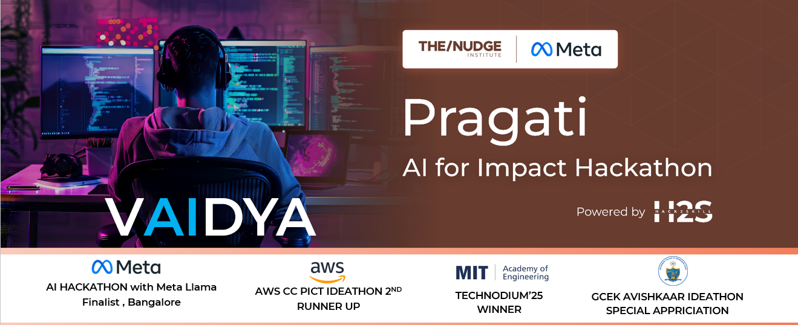
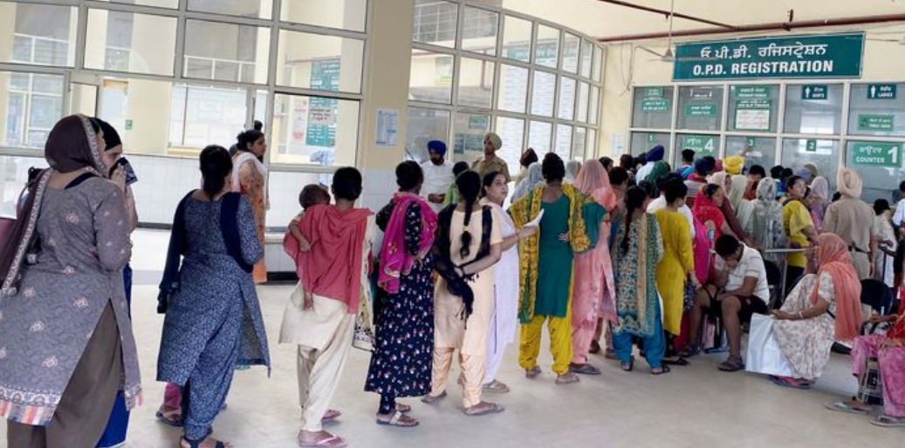
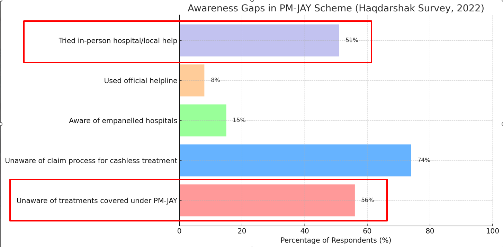
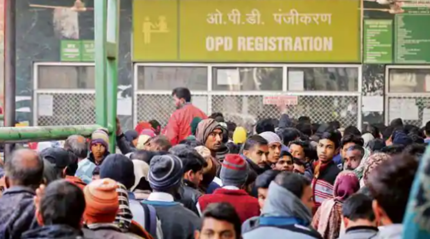
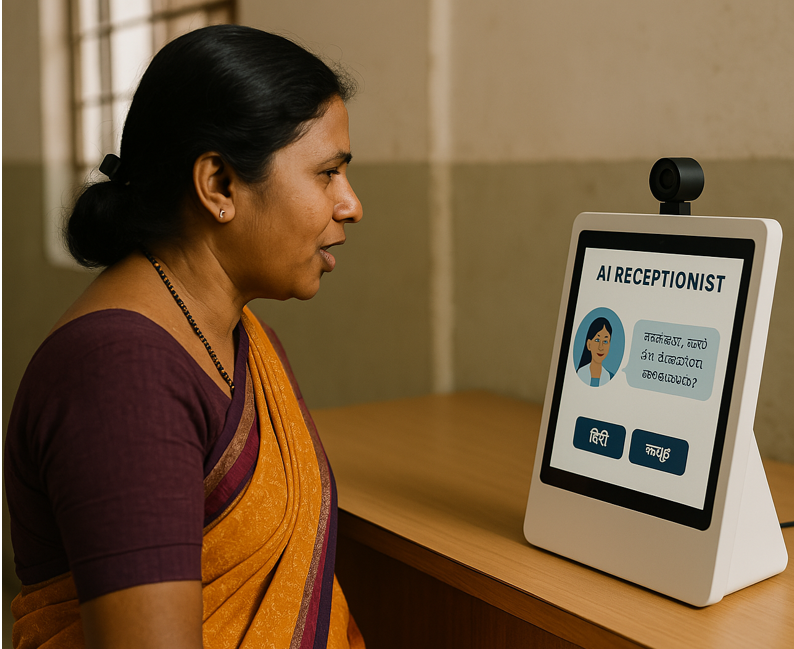
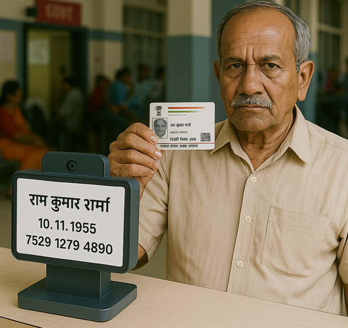
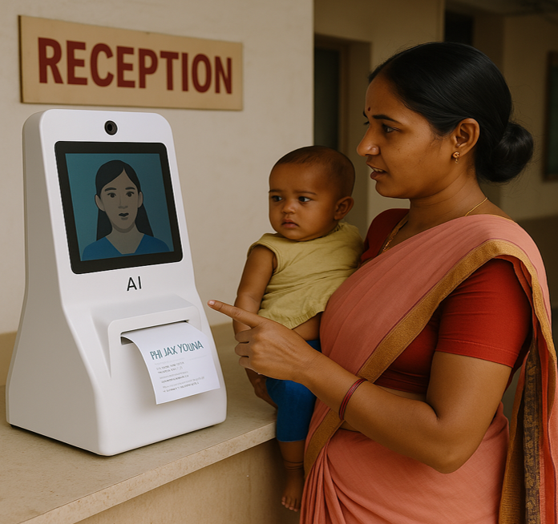

<!-- Banner Image -->

  

# ‎ ‎ ‎ ‎‎ ‎  ‎ ‎‎‎ ‎ ‎‎ ‎ ‎ ‎  ‎ 🏥 Vaidya – AI Receptionist for Our People

  

Vaidya, multilingual AI-powered hospital receptionist designed for government hospitals. It automates patient interaction, scheme eligibility checks, appointment booking, and case paper generation—offering 24/7 support with zero waiting time. 

## OFFLINE , MULTILANGUAL , HARDWARE ACCESS , CLOUD FREE , NO DIGITAL LITRACY REQUIRED
# 🔗 **Demo:** [ai-vaidya-patient-guide.lovable.app](https://ai-vaidya-patient-guide.lovable.app/)  

---

## © 2025 ADROIT A Software Development and Versatile Community – All Rights Reserved.

This software/application is developed by **ADROIT**, a software development and versatile community.  
It is **published strictly for evaluation purposes** as part of the **Pragati AI for Impact Hackathon**.

>Please do not attempt to clone, reuse, or redistribute this project.  
Even if cloned, this system **will not function without the SLM **.

**Any unauthorized modification, distribution, or usage of this project or its components is prohibited. Legal action will be taken** against violators under applicable IP laws.

---

<h2 style="font-family: 'Montserrat', sans-serif; font-size: 4px;">🧪 PROBLEM IDENTIFIED AND RESEARCHED</h2>

<b>Lack of Awareness & Access to Healthcare Schemes</b> 
• State and Central governments have provided 15+ schemes for reducing healthcare costs/burden. 
• As of 2017–2018, only 14.1% of the rural population had health insurance coverage. 
• Lack of awareness of schemes, applicability, and application process is the major hurdle in using these benefits.

<b>Infrastructure Gaps</b> 
• Doctor-patient or Patient-Receptionist ratio of ~1:1456 and ~1:25,000 in rural areas.

<b>Receptionist Quality & Quantity Crisis</b> 
• Many hospitals lack sufficient trained receptionists, especially during peak hours. 
• The few available receptionists are often untrained or unable to handle the high volume of patients. 
• This results in: 
&nbsp;&nbsp;&nbsp;&nbsp;– No one explaining government scheme benefits to the patients 
&nbsp;&nbsp;&nbsp;&nbsp;– Confusion and chaos at registration desks 
&nbsp;&nbsp;&nbsp;&nbsp;– Increased wait times and patient dissatisfaction 
<h2 style="color:red">• Ultimately, patients are not getting the facilities they are entitled to — not because they don’t exist, but because the front desk fails to deliver them.</h2>

<!-- Images -->

  
  
  

## 🌟 Why Vaidya is the Best
## ✅ **Works Offline:**  Powered By llama SLM , it works without internet and Any cloud Dependancy
- ✅ **Built for Bharat:** Designed with Indian rural needs in mind—vernacular languages, offline support, and affordable deployment.
- ✅ **Fully Automated Reception:** Reduces patient waiting time and improves first-contact quality in hospitals with staff shortages.
- ✅ **Hardware-Aware AI:** Not just a chatbot—Vaidya interacts with real-world devices like printers and ID scanners.
- ✅ **Scheme Smart:** Guides patients through eligibility and benefits of government health schemes.
- ✅ **Plug-and-Play:** Deployable on low-power devices (Android) requiring minimal setup and infrastructure.
---
## 🌟 TALKS IN HINDI🌟 AUTOMATIC DATA INPUT🌟PRINTER FOR HARD COPY

  
  
  

---

> "Vaidya is not just an assistant—it's a healthcare bridge between people and policy."

---
##  ‎ ‎ ‎‎ ‎  ‎ ‎‎‎ ‎ ‎‎ ‎ ‎ ‎ ‎                                                              ‎ ‎‎ ‎ ‎🔍 FINE-TUNED MODELS → `VAIDYA_MIDNIGHT`By Nawaz Sayyad

 ‎ ‎ ‎‎ ‎  ‎ ‎‎‎ ‎ ‎‎                                     ‎ ‎ ‎ ‎ ‎‎ ‎  ‎ ‎‎‎ ‎                             ‎ ‎ ‎ ‎ ‎‎ ‎  ‎ ‎‎‎ ‎                             ‎ ‎ ‎ ‎ ‎‎ ‎  ‎ ‎‎‎ ‎                             ‎ ‎ ‎ ‎ ‎‎ ‎  ‎ ‎‎‎ ‎ ‎‎                            ‎ ‎ ‎ ‎ ‎‎ ‎  ‎ ‎‎‎ ‎                             ‎ ‎ ‎ ‎ ‎‎ ‎  ‎ ‎‎‎ ‎                             ‎ ‎ ‎ ‎ ‎‎ ‎  ‎ ‎‎‎ ‎  ‎ ‎ ‎ ‎ ‎ ‎ ‎‎ ‎  ‎ ‎‎‎ ‎ ‎‎ ‎ ‎ ‎ ‎ ‎‎ ‎  ‎ ‎‎‎ ‎ ‎‎ ‎ ‎ ‎‎ ‎  ‎ ‎‎‎ ‎ ‎‎ ‎ ‎  
 
##       VAIDYA FINE TUNED MODELS REPO HUGGING FACE =                           [vaidya_midnight](https://huggingface.co/nawazadroit)

- 📫 **Contact:** Nawaz Sayyad, ADROIT Team  
